# How the "AI" is embedded in the ACSE demo

**Short version: there is no real AI in this demo — it's a scripted simulation, by
design.** No LLM, no API calls, no backend. It's 100% front-end make-believe that
*looks* like an AI resolving utility requests.

This matches the direction from the July 14 client meeting:

- **Obe:** "we're creating smoke and mirrors right here… you want to show them what
  it does, how it flows." Build a **storyboard** and just play it start-to-finish.
- **The team:** "no users exist, everything is mock data, so we get to control the
  show time."

The real AI/backend (RAG, vector DB, C2M integration) is intentionally out of scope
for this POC. See [Where a real AI would plug in](#where-a-real-ai-would-plug-in-later).

---

## The four moving parts

### 1. The script — `src/data/scenarios.ts`

Every "AI conversation" is a hand-written list of steps. Each step has a `kind`:

| `kind` | Renders as |
| --- | --- |
| `user` | a right-aligned user chat bubble |
| `ai` | a left-aligned assistant bubble |
| `status` | the spinner line, e.g. *"Connecting to C2M…"* |
| `otp` | the SMS / email identity-verification card |
| `summary` | the structured confirmation card (request details) |
| `done` | the green success line |

So "Start service" is just ~13 pre-written steps in an array. The assistant never
*decides* anything — it replays a fixed sequence.

```ts
"start-service": {
  steps: [
    { kind: "user",   text: "I'd like to start water service at a new address." },
    { kind: "ai",     text: "Happy to help you start service, {name}. First I need to confirm it's you on account {account}." },
    { kind: "status", text: "Sending a one-time code to the phone on file…" },
    { kind: "otp",    channel: "sms", text: "A 6-digit code was sent by SMS. (Demo: auto-verified)" },
    // …gather address → validate territory → submit → confirm…
    { kind: "done",   text: "Start-service request logged to {source} and to the audit trail. Reference SR-4471-190." },
  ],
}
```

### 2. The playback engine — `src/components/demo/ChatWindow.tsx`

A `play()` async loop walks the steps and reveals them one at a time. Before each
assistant step it turns on a typing indicator and waits, so it *feels* like the
assistant is thinking and typing. `delayFor()` scales the pause to the message length.

```
for each step in scenario:
  if it's a user step   → wait ~0.5s, then show the bubble
  else (ai/status/…)    → show "typing…" dots → wait 0.7–1.5s → show the bubble
```

That timed reveal is the entire "intelligence." A `runRef` guard lets a new
scenario (or Restart) cancel an in-flight playback cleanly.

### 3. "Understanding" typed input — `matchScenario()`

When someone types free text, there is **no NLP or LLM** — it's a prioritised
keyword lookup:

```ts
"why is my bill so high"   // contains "bill so" → high-bill scenario
"there's a leak"           // contains "leak"    → report-leak scenario (emergency, checked first)
```

If nothing matches, the assistant falls back to *"here's what I can do — pick one."*
Clicking a use-case pill skips matching and plays that scenario directly.

### 4. Making it feel personal — token interpolation (`resolve()`)

Scripts contain placeholders that are swapped for live values at render time:

| Token | Filled with |
| --- | --- |
| `{name}` | selected customer's name |
| `{account}` | selected account number (the chatbot context) |
| `{address}` | account service address |
| `{source}` | active data-source label — **C2M (live)** or **Autonomous DB** |
| `{sourceSystem}` | full system name of the active source |

Customer values come from `src/data/customers.ts`; `{source}` comes from the Redux
data-source toggle. That's why flipping **C2M ↔ Autonomous** mid-demo visibly
changes the assistant's words (e.g. *"Reading history from C2M (live)…"*).

---

## One turn, end to end

```mermaid
flowchart LR
  A[Pick a customer] --> B[Set context in Redux]
  B --> C{Pill click or typed text?}
  C -- pill --> E[Look up storyboard]
  C -- typed --> D[matchScenario keyword lookup] --> E
  E --> F[play&#40;&#41; replays steps with fake typing delays]
  F --> G[resolve&#40;&#41; injects customer + data source]
  G --> H[Bubbles / cards appear in the chat]
```



No step in that chain calls a model or a server — it's all local state and timers.

---

## Where a real AI would plug in later

The demo deliberately stops at the front-end. When you move to the real product,
the swap points are clean and the rest of the UI stays:

| Demo (now) | Real product (later) |
| --- | --- |
| `matchScenario()` / `startScenario()` | An LLM (e.g. Claude) returns the next message + a tool call |
| `status` / `summary` steps | **Actual tool calls** to your backend → C2M or the Autonomous DB |
| The C2M / Autonomous toggle (cosmetic label) | A real routing flag that chooses which system the tools hit |
| Static knowledge in the scripts | RAG retrieval from the vector DB (the architecture Bhupati diagrammed) |

Only the "brain" behind `ChatWindow` changes — the customer context, storyboard
structure, dashboard, and data-source toggle all carry over.

---

## Files at a glance

| Concern | File |
| --- | --- |
| Conversation scripts | `src/data/scenarios.ts` |
| Playback engine, keyword match, token resolve | `src/components/demo/ChatWindow.tsx` |
| Synthetic customers (list of values) | `src/data/customers.ts` |
| Use-case pills | `src/data/useCases.ts` |
| Internal C2M / Autonomous toggle | `src/components/demo/DataSourceToggle.tsx` + `src/store/dataSourceSlice.ts` |
